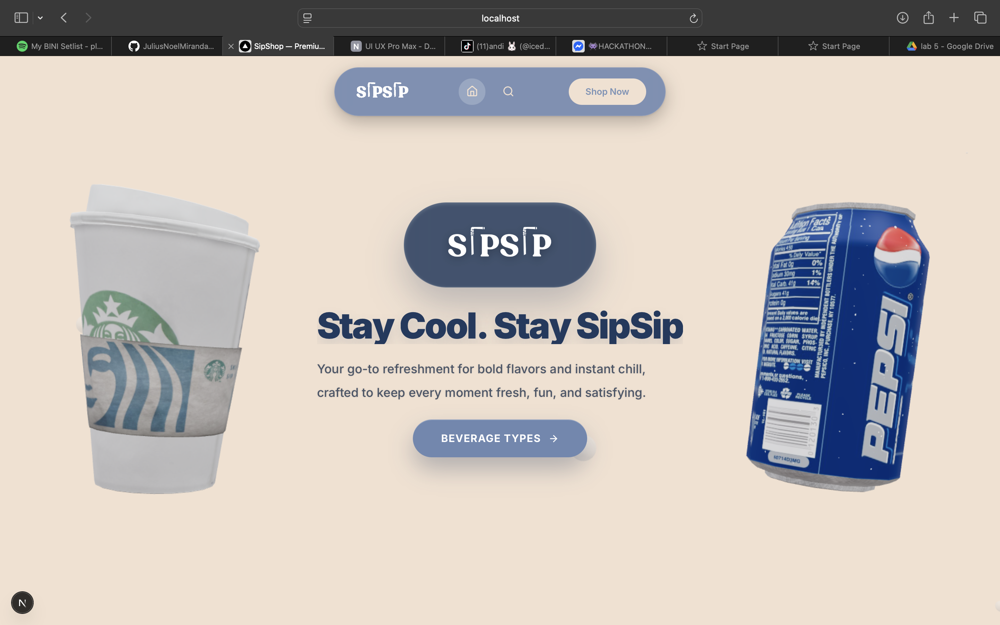

# SipShop (SIPSIP)

SipShop is a web application that serves as a directory and storefront for beverage products. It provides a browsing and shopping interface for items such as smoothies, cold brews, milk teas, and kombuchas.

---

## 📷 Demo




---

## ✨ Features

- **3D Hero Interface**: A landing section that implements 3D elements reacting to user scroll inputs.
- **Product Search**: A multi-field search engine supporting case-insensitive queries for products and descriptions.
- **Filtering System**:
  - Dual-thumb price range sliders.
  - Minimum rating threshold selection.
  - Stock status filtering (In Stock, Low Stock, Out of Stock).
  - Category and tag sorting (Featured, New Arrivals, On Sale).
- **Sorting Mechanism**: Organizes results by rating, price, stock availability, date added, and alphabetical order.
- **Pagination Structure**: A hybrid navigation system that includes a toggle function to switch between traditional page-by-page viewing and continuous infinite scroll loading.
- **Authentication**: User login and registration integrated with Supabase and NextAuth, supporting both credentials and OAuth providers.

---

## 🛠 Technologies Used

### Frontend & UI
- **Framework**: Next.js 16 (App Router), React 19
- **Styling**: Tailwind CSS v4
- **3D Integration**: Three.js, `@react-three/fiber`, `@react-three/drei`
- **Animations**: GSAP (`@gsap/react`), Framer Motion (`motion`)
- **Iconography**: Lucide React

### Backend & Data
- **Database/ORM**: Prisma Client, Neon Serverless Postgres
- **Authentication**: NextAuth, `@supabase/supabase-js`

---

## 🚀 How to Run the Application

### 1. Clone the Repository

```bash
git clone https://github.com/JuliusNoelMiranda18/SIPSIP.git
cd SIPSIP
```

### 2. Install Dependencies

Choose one of the following package managers to install dependencies:

```bash
npm install
# or
yarn install
# or
pnpm install
```

### 3. Configure Environment Variables

Create a `.env` file in the root directory with the following variables:
- `DATABASE_URL`: Connection string for Neon Postgres.
- `NEXTAUTH_SECRET`: Secret key for NextAuth.
- `NEXTAUTH_URL`: Base domain URL of the application.
- Supabase endpoints and keys (if applicable beyond standard NextAuth setups).

*(Consult `.env.example` if available in the repository)*

### 4. Initialize Database

Generate the Prisma Client and migrate the schema to the database. Optionally, seed the initial data:

```bash
npx prisma generate
npm run db:push
npm run db:seed
```

### 5. Start Development Server

```bash
npm run dev
```

Navigate to [http://localhost:3000](http://localhost:3000) to view the application in the browser.
